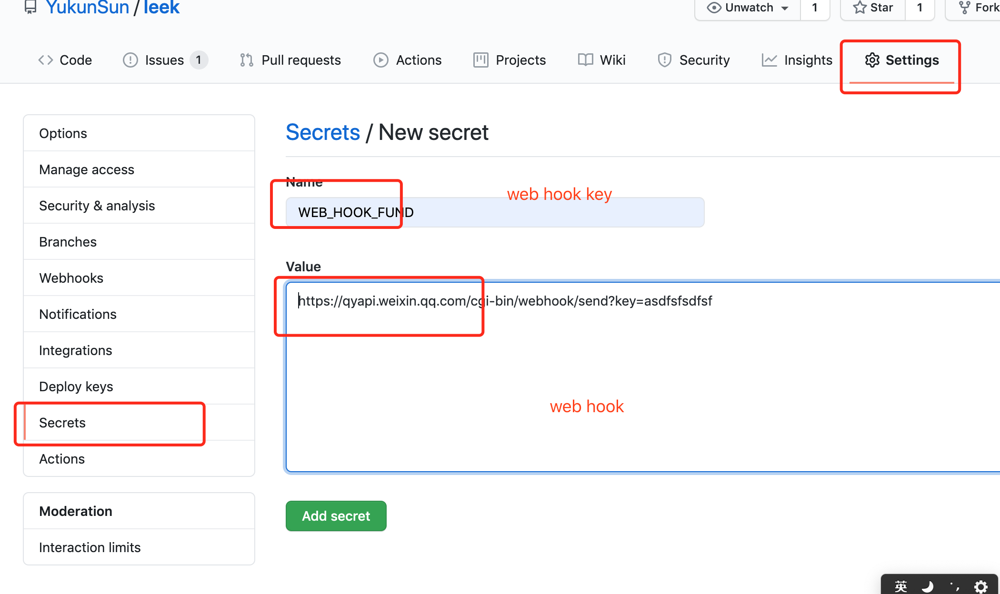

[TOC]

<!--ts-->
   * [leek](#leek)
      * [Preparation](#preparation)
      * [Application](#application)
         * [基金估值表消息推送](#基金估值表消息推送)
         * [今日可转债申购提醒](#今日可转债申购提醒)
      * [Usage（以 fund 消息为例）](#usage以-fund-消息为例)
      * [环境变量](#环境变量)

<!-- Added by: sunyk, at: Wed Sep  2 09:06:02 CST 2020 -->

<!--te-->

# leek

## Preparation

- github 账号
- 企业微信 bot(也可使用飞书等其他工具，只要具备 bot 功能即可)

## Application

### 基金估值表消息推送

数据来源：

- [银行螺丝钉-指数估值表](https://danjuanapp.com/screw/valuation-table)

### 今日可转债申购提醒

数据来源：
- [同花顺数据中心](http://data.10jqka.com.cn/ipo/bond/)

## Usage（以 fund 消息为例）

1. fork 代码到自己的仓库

2. 注册企业微信，然后创建一个 bot,并将 bot 的 key 配置到 Github Secret 中,`Name=BOT_KEY_QYWECHAT_FUND`.

3. 待 Github Actions 执行后可以在企业微信内收到提醒消息

## 环境变量

- WEB_HOOK_BOND
- WEB_HOOK_FUND
