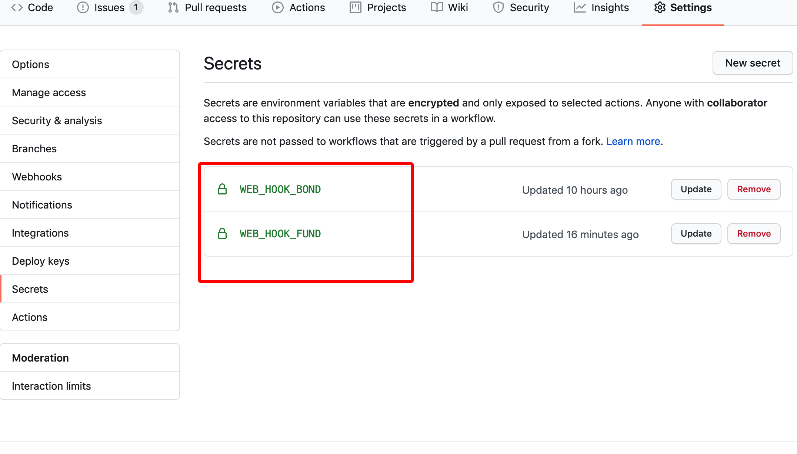

<!--ts-->
   * [leek](#leek)
      * [Preparation](#preparation)
      * [Application](#application)
         * [基金估值表消息推送](#基金估值表消息推送)
         * [今日可转债申购提醒](#今日可转债申购提醒)
      * [Usage（以 fund 消息为例）](#usage以-fund-消息为例)
      * [Webhook 列表](#webhook-列表)

<!-- Added by: sunyk, at: Thu Sep  3 07:52:37 CST 2020 -->

<!--te-->

# leek

leek 是一个基于 web hook 和 Github Actions 的自动推送提醒项目。

- 目前仅收录金融类信息的推送功能，欢迎贡献代码

优点：
- 无需服务器
- 开箱即用

## Preparation

- github 账号
- 企业微信 bot 的 webhook 地址(也可使用飞书等其他工具，只要具备 webhook 地址即可)

## Application

### 基金估值表消息推送

数据来源：

- [银行螺丝钉-指数估值表](https://danjuanapp.com/screw/valuation-table)

### 今日可转债申购提醒

数据来源：
- [同花顺数据中心](http://data.10jqka.com.cn/ipo/bond/)

## Usage（以 fund 消息为例）

1. fork 代码到自己的仓库

2. 注册企业微信，然后创建一个 bot,并将 bot 的 webhook 地址配置到 Github Secret 中,`Name=WEB_HOOK_FUND`（可参考“Webhook 列表”）.

注：配置完成以后的列表举例：

3. 待 Github Actions 执行后可以在企业微信内收到提醒消息

## Webhook 列表

如果只想由一个 web hook 接收消息，把所有的地址配置成一个相同的 web hook 即可

- WEB_HOOK_BOND：债券相关的 webhook 地址
- WEB_HOOK_FUND：基金相关的 webhook 地址
